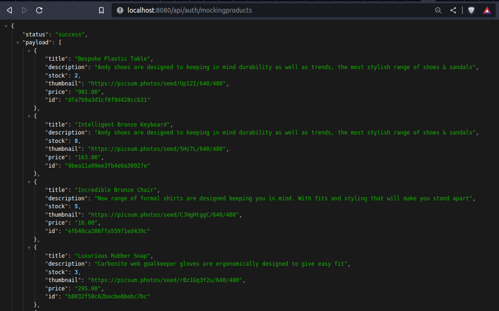
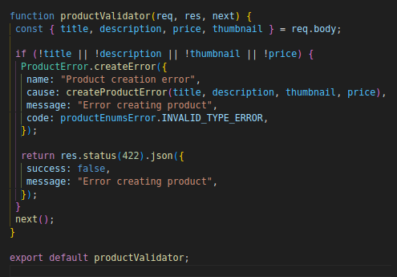
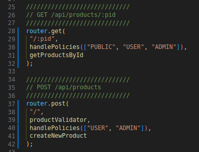
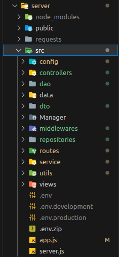
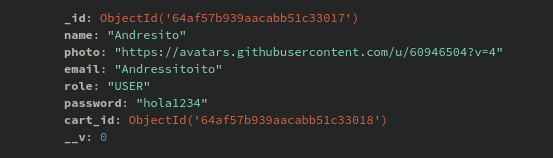
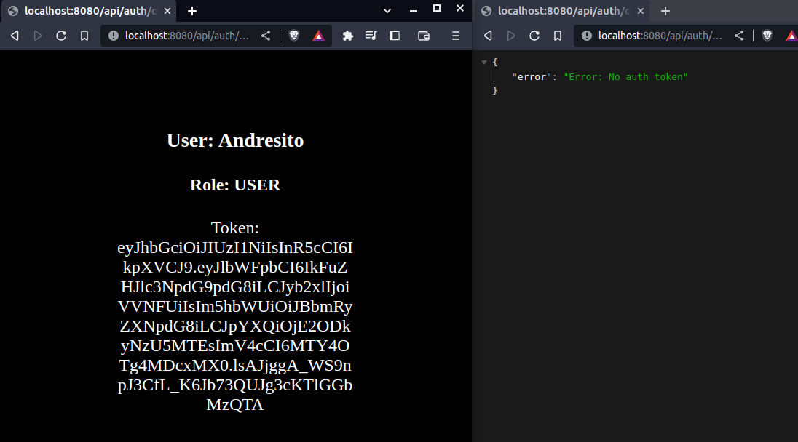
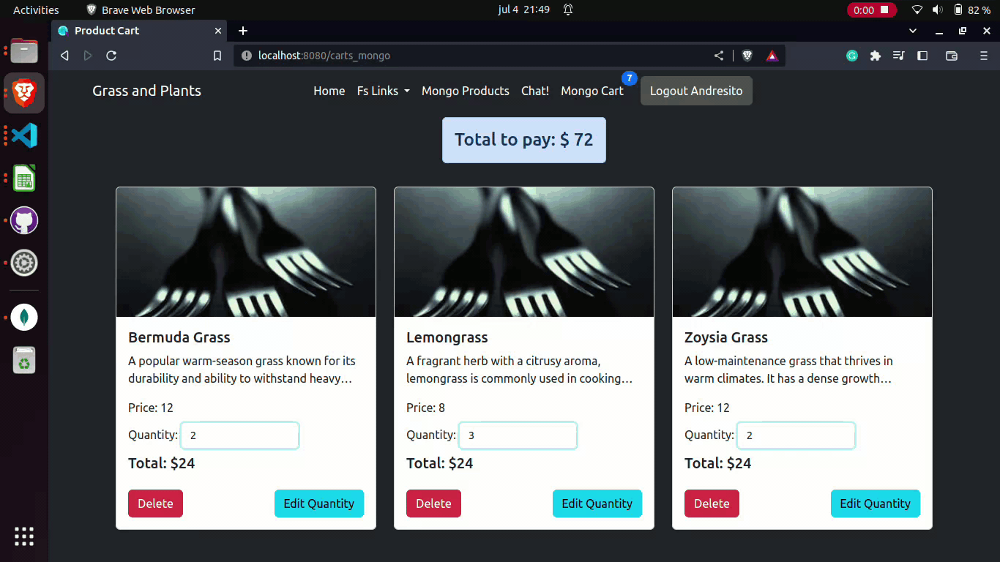
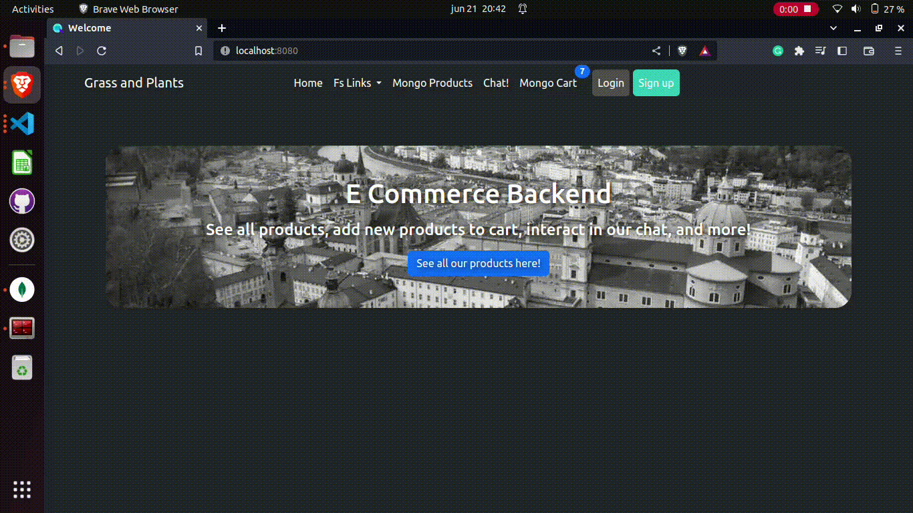
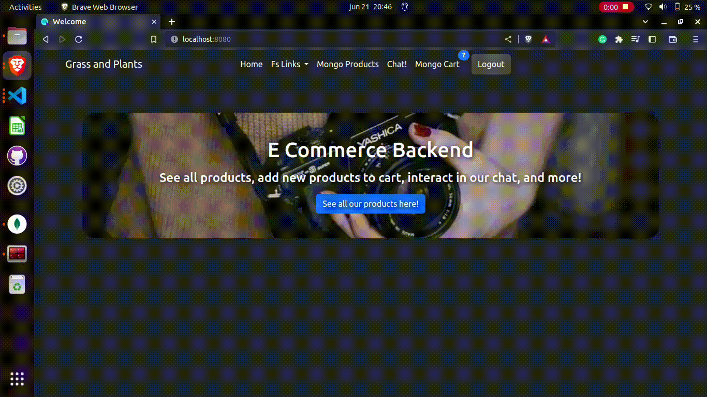

# E-Commerce Product Class Repository

This repository contains a server build with Node.js and Express, set up to run on port 8080.

# New Features

### Mocking Products Router for Real-Time Product Mock

A new products router was successfully implemented, integrating mock data to showcase a real-time list of randomized products. 

### Custom Error Middleware for Enhanced Product Creation

As part of improving error handling, a custom error middleware was introduced, specifically designed to handle errors during product creation processes. 

# Previous Features

### Ticket Model for Streamlined Purchases

A new ticket model was introduced to facilitate seamless purchase processing. The ticket model enables users to initiate, manage, and track their purchases efficiently. Each ticket is associated with a specific purchase, containing relevant transaction details and status updates. With this ticket model, customers can easily complete their purchases and stay informed about the progress of their transactions.

### Implementing handlePolicies Middleware for Secure Transactions

To enhance security and prevent unauthorized transactions, the handlePolicies middleware was integrated into the system. This middleware verifies user permissions and ensures that only authorized users can perform certain actions, such as making purchases or accessing sensitive data.

### Complete Server Refactoring: Folder Structure and Module Organization

Extensively refactored the entire server codebase to implement a more organized folder structure and module management. Created 'Dao' (Data Access Object) and 'DTO' (Data Transfer Object) folders, as well as 'Service,' 'Repository,' and 'Controllers' components. This comprehensive refactoring ensures better code separation, modularity, and scalability, setting a solid foundation to manage future growth and maintainability of the application.

### User model with Cart_Id linked, and role

This new user model is now associated with the cart_id. Upon creation, each user is assigned a unique cart_id that is linked to the user. Also the role user is now created by default as "USER".

### API route to check current user

This API route 'api/auth/current' can be utilized to verify the current status of the user. If the user is logged in, their data will be displayed; otherwise, an error message saying 'no token authentication' will be returned.

### User creation with Github

Creation of user accounts using Github authentication, integrating Github's OAuth authentication flow, and using the Github API to retrieve user information.

### Logout user with Github

Implementing the Github authentication flow, which redirects users to Github's login and logout page and handles the callback with an access token.

### Protection of routes until user is logged

To ensure that only authenticated users can access them, middleware functions that check if a user is logged in before allowing access to protected routes. This protection, you can restrict certain parts to authenticated users only, preventing unauthorized access and securing sensitive data or functionalities.

### Working with JWT tokens to ensure user authorization

Generating and signing JWT tokens on the server side, send and verify these tokens on subsequent requests. By leveraging JWT tokens, applications can authenticate and authorize users without the need for server-side sessions.

### User Creation

- This feature enables the creation of new user accounts within the system. It provides a way for individuals to register and create their unique profiles.

### Login and Sign Out

- The Login and Sign Out functionality provides a secure way for users to access their accounts. Sign Out allows users to log out, terminating their current session and preventing unauthorized access.

### Protected Routes for Non-Admin User

- Protected Routes for Non-Admin User restricts certain pages or sections of the application to authorized users only. Non-admin users are granted limited access, ensuring that sensitive or administrative functionalities are restricted to the admin user.

### Admin User Unique

- The Admin User Unique feature designates a specific user as the administrator, granting them elevated privileges and additional control over the system.

### Pagination of products

- Introducing pagination functionality to the server, allowing users to browse through products in a more organized and manageable manner.

### Search Products by Name

- The server now supports searching for products by their name, providing users with a quick and convenient way to find specific products.

### Updated Cart View with Subtotals and Total Amount

- The cart view has been enhanced to display subtotals for individual items and the total amount to pay for the entire cart.

### API Endpoint for Total Amount Calculation

- We have added a new API endpoint that enables clients to calculate the total amount to pay for their purchases.

### Products home page with MongoDB

- From the home page where we can select tabs, products from MongoDB or local.

### Adding a Product in MongoDB

- Demostration of the process of adding a new product in MongoDB, same UI as local but in MongoDB

### Products home page showing navbar

- From the home, users can easily navigate to see all products, see cart and more.-

### Adding a Product with Success Transaction Alert

- This video demonstrates the process of adding a product to the cart, along with a success transaction alert.

### Exploring Product Cards and Adding to Cart

- In this video, users can browse through different product cards, click on "More Details" to view additional information, and add the selected product to the cart.

### Updating Cart by Editing Product Quantity

- This video showcases the functionality of updating the cart by editing the quantity of a specific product.

### Error Handling and Chat Support

- This video highlights error handling in the application and provides a link to the chat feature, where users can seek assistance.

## The server has endpoints for products and carts:

## Products

### GET Products

Returns all products.

- `/api/products`

### GET Product by ID

Returns a single product by ID.

- `/api/products/:pid`

### GET Product by ID Error

Returns an error message if a product with the specified ID cannot be found.

- `/api/products/:pid`

### POST Product

Adds a new product.

- `/api/products/`

### POST Product Error Repeated Product

Returns an error message if there is an issue adding a new product.

- `/api/products/`

### POST Product Error Wrong Prop

Returns an error message if there is an issue adding a new product.

- `/api/products/`

### PUT Update Product

Updates an existing product.

- `/api/products/:pid`

### PUT Update Product Error

Returns an error message if there is an issue updating an existing product.

- `/api/products/:pid`

### DELETE Product

Deletes an existing product.

- `/api/products/:pid`

### DELETE Product Error

Returns an error message if there is an issue deleting an existing product.

- `/api/products/:pid`

## Carts

### GET Carts

Returns all carts.

- `/api/carts/`

### GET Cart by ID

Returns a single cart by ID.

- `/api/carts/:cid`

### GET Cart by ID Error

Returns an error message if a cart with the specified ID cannot be found.

- `/api/carts/:cid`

### POST Empty Cart

Adds a new empty cart.

- `/api/carts/`

### UPDATE Product in Cart

Updates the quantity of a product in a cart.

- `/api/carts/:cid/product/:pid/:units`

### UPDATE Product in Cart Error Not enough stock

Returns an error message if there is no enough stock of a product to add in a cart.

- `/api/carts/:cid/product/:pid/:units`

### UPDATE Product in Cart Error Id error

Returns an error if a cart with the specified ID cannot be found.

- `/api/carts/:cid/product/:pid/:units`

### DELETE Product from Cart

Deletes a product from a cart.

- `/api/carts/:cid/product/:pid/:units`

### DELETE Product from Cart Error

Returns an error message if is trying to delete more items than the actual stock from a cart.

- `/api/carts/:cid/product/:pid/:units`

To use this repository, clone it to your local machine and run `npm install` to install the necessary dependencies. Then, start the server with `npm start`.
